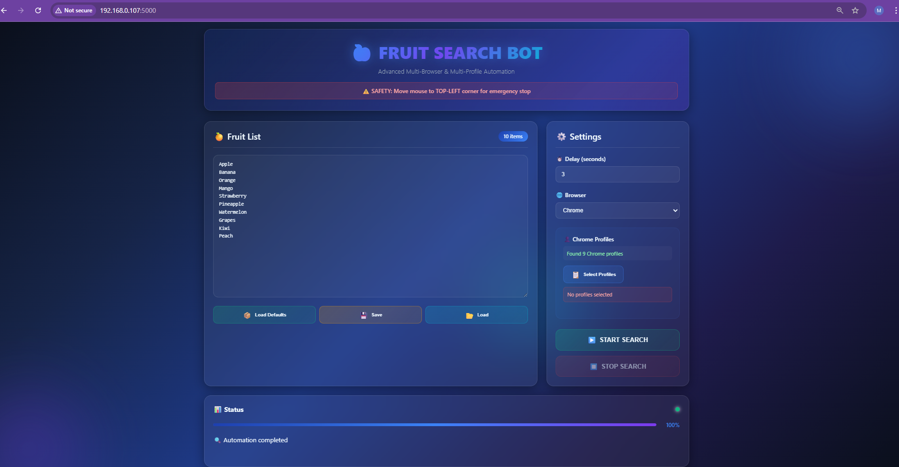

# 🍎 Fruit Search Bot  
> **“Search smarter, not harder.”**  
Automate fruit (or anything!) searches across browsers with real Chrome profile control — all from a sleek web UI.  

<p align="center">
  
</p>  

<p align="center">
  
  
  
  
</p>  

---

## ✨ Why use this?
- 🔍 Automates **browser searches** with one click.  
- 👤 Detects and uses your **real Chrome profiles** (e.g. *Personal, Work, Gaming*).  
- 🌐 Supports **Chrome, Edge, Firefox, Brave, Opera, Safari**.  
- 📊 Live **progress tracking** & status updates.  
- 💾 Save & reload your **fruit list** easily.  
- 🛑 **Failsafe**: slam your mouse to the top-left corner to instantly stop.  

---

## 🚀 Quick Start

### 1️⃣ Clone & Install
```bash
git clone https://github.com/your-username/fruit-search-bot.git
cd fruit-search-bot
pip install Flask Flask-Cors pyautogui
```

### 2️⃣ Run the App
```bash
python app.py
```
Now open 👉 [http://localhost:5000](http://localhost:5000)  

---

## 🌐 Web UI Walkthrough
<p align="center">
  
</p>  

1. ✏️ Add or load fruits  
2. 🌍 Choose a browser  
3. 👤 (For Chrome) Select one or more profiles  
4. ⏱ Set delay between searches  
5. ▶️ Hit **Start** and watch automation go!  

---

## 🖥️ CLI Mode (for pros)
```bash
python app.py --cli --file fruits.json --delay 2 --browser chrome --profiles "Work" "Personal"
```
- `--file` → JSON with fruits  
- `--delay` → seconds between searches  
- `--browser` → chrome, edge, firefox, brave, opera, safari  
- `--profiles` → specific Chrome profiles  

---

## 📸 Demo in Action
<p align="center">
  
</p>  

---

## ⚠️ Safety
- PyAutoGUI **failsafe enabled** → Move mouse to top-left corner to abort instantly.  
- Works only in graphical environments (Windows/macOS/Linux desktop).  

---

## 🩺 Health Check API
```bash
curl http://localhost:5000/api/health
```
Response:
```json
{
  "status": "healthy",
  "platform": "Windows",
  "chrome_dir": "C:\\Users\\Me\\AppData\\Local\\Google\\Chrome\\User Data"
}
```

---

## 📜 License
MIT License. Free to use & modify.  
